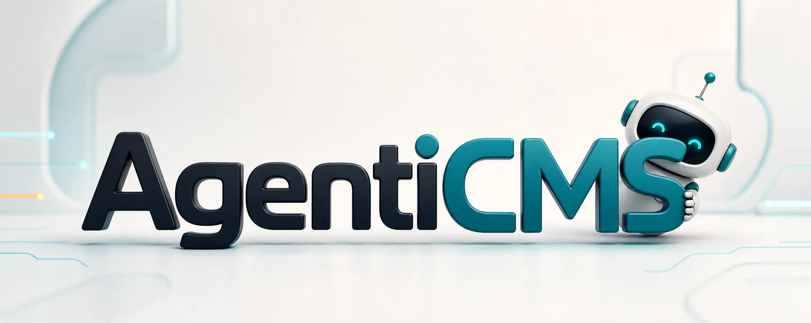
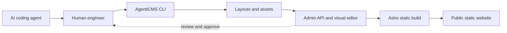
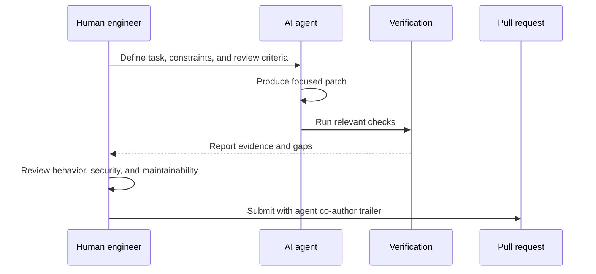

# AgentiCMS




AgentiCMS is an AI-first CMS for static websites. It gives editors and coding
agents the same controlled workflow: create pages, assign layouts, edit content,
sync assets, review in the admin UI, and publish static builds without turning
Git into the editorial interface.

The project exists as a production software showcase: AI agents can contribute
real, maintainable software when a human software engineer defines the intent,
reviews the result, verifies behavior, and keeps the security boundary clear.

## Status

AgentiCMS is early open-source software. The production architecture is already
used by AgentiCMS maintainers, but APIs, command names, and repository structure may
still change before the first public release.

License: AGPL-3.0-or-later.

## How It Works



AgentiCMS separates the editorial workflow from Git while keeping changes
reviewable. Agents work through the same CLI and admin boundaries as humans.
Production output is static HTML served by the website layer.

## Architecture

- `admin/`: Fastify API, Prisma models, backend services, route tests, and the
  Vite React admin frontend in `admin/frontend/`.
- `cli/`: local operator CLI for approved login, site management, layout sync,
  asset sync, and build commands.
- `website/`: Astro renderer and nginx/static serving layer.
- `docker-compose.yml`: example admin, website, and PostgreSQL topology.

The public site is static output. The admin API is intended to stay private
behind nginx or a trusted tunnel. Layout files are trusted admin-controlled code.

## Local Development

Copy `.env.example` to `.env` and fill in strong secrets before running the full
Docker topology.

```bash
cd admin && npm install
cd admin && npm run dev

cd admin/frontend && npm install
cd admin/frontend && npm run dev

cd cli && npm install
cd cli && npm run build

cd website && npm install
cd website && npm run dev
```

Useful verification commands:

```bash
cd admin && npm test
cd admin/frontend && npm run build
cd cli && npm test
cd website && npm test
docker compose config
```

## CLI Workflow

The CLI is the intended way for humans and agents to work on layout and asset
files without SSHing into a server:

```bash
agenticms login https://cms.example.com
agenticms status --site demo --url https://cms.example.com
agenticms sync layouts --site demo
agenticms sync assets --site demo
```

Workspaces use root-level `site.json`, `layouts/`, and `assets/`. Older `.agenticms/site.json` workspaces remain supported.

Production builds and deployments must be explicitly approved by the site owner.
Use staging builds for review whenever possible.

## AI-Agent Contribution Rule



AgentiCMS accepts contributions only through an AI-agent-assisted workflow. This
is intentional: the repository should demonstrate how production-ready software
can be built when AI agents are directed, constrained, and reviewed by engineers.

Every contribution must follow these rules:

- Use an AI coding agent to produce or materially co-produce the change.
- Keep a human engineer accountable for the final patch, tests, and security.
- Include the agent as a commit co-author.
- Describe the agent workflow in the pull request.
- Include the verification commands that were run.

Commit messages must include a `Co-authored-by` trailer for the agent. Use the
exact agent and model label reported by the tool; do not use a vendor email or a
fake address.

```text
feat: add site-specific build status pagination

Co-authored-by: Codex GPT-5
```

Manual-only commits are not accepted unless they are explicitly approved by the
maintainers for repository administration, legal, or emergency security work.

## Pull Requests

Pull requests should include:

- A short behavior summary.
- The AI agent used and what it changed.
- Verification commands and results.
- Screenshots for visible admin/frontend changes.
- Notes for Docker, migration, deployment, or security impacts.

Use focused commits with prefixes such as `feat:`, `fix:`, `test:`, `docs:`,
and `chore:`.

## Security

Do not open issues for vulnerabilities. Follow `SECURITY.md`.

Do not commit secrets, private deployment details, live tokens, database dumps,
or customer content. Treat CLI tokens, admin JWT secrets, internal API keys, and
Cloudflare tunnel configuration as sensitive.
